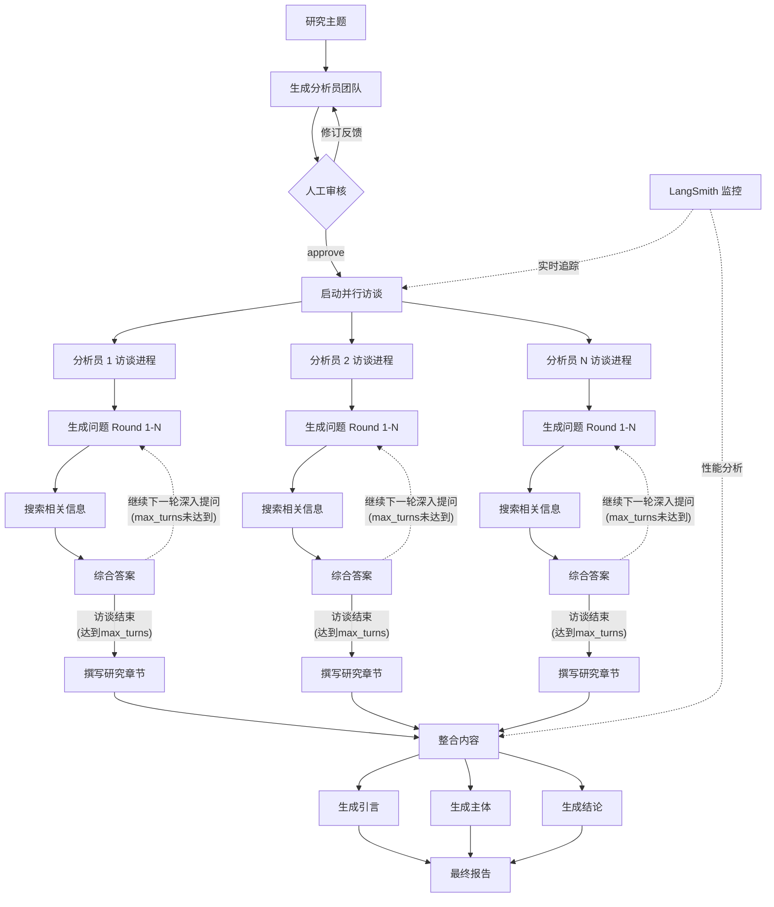
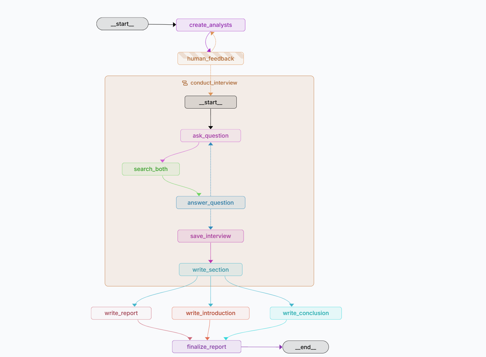

# 📚多视角研究助手系统

[](https://www.python.org/)
[](https://github.com/langchain-ai/langgraph)
[](https://github.com/langchain-ai/langchain)

## 🌟 Overview

多视角研究助手是一个先进的AI驱动研究系统，通过协调多个AI分析员对任何主题进行全面分析。每个分析员从独特的视角独立采访领域专家，然后将研究发现综合成一份连贯的研究报告

### 🎯 核心特性

- **多智能体架构**：生成具有不同视角的专业AI分析员
- **自动化访谈**：每个分析员进行结构化的专家访谈
- **双搜索集成**：结合Tavily和Google搜索进行全面信息收集
- **动态工作流**：使用LangGraph构建复杂的状态化对话流
- **交互式审核**：人机协作设计，支持分析员审批和优化
- **综合报告**：自动生成结构良好、带引用的研究文档
- **MCP集成**：使用MCP实现了tools与Graph解耦合，标准化的请求和响应格式

🔍 **LangSmith监控**：完整的可观测性，包括追踪、调试和性能监控

## 🏗️ Graph 结构





## 📁 项目结构

```
multi-perspective-research/
├── src/                        # 核心应用模块
│   ├── __init__.py            
│   ├── config.py              # 环境和LLM配置
│   ├── models.py              # Pydantic模型和类型定义
│   ├── prompts.py             # AI指令模板
│   ├── tools.py               # 搜索和工具函数
│   ├── agents.py              # LangGraph工作流和节点
│   └── main.py                # CLI应用入口点
├── notebooks/
│   └── research_assistant.ipynb           # Jupyter Notebook版本
├── langgraph_studio/
│   └── research_assistant_studio.py      # LangGraph Studio 兼容版本
│   └── langgraph.json                    # LangGraph Studio 配置
├── examples/
│   └── sample_reports.md        # 生成的报告示例
├── requirements.txt           # 项目依赖
├── .env.example              # 环境变量模板
├── .gitignore                # Git 忽略规则
└── README.md                 # 本文件
```

## 🚀 Quick Start

### 环境要求

- Python 3.10 或更高版本
- 以下服务的API密钥：
  *   任意兼容OpenAI接口的LLM服务（以ModelScope为例）
  *   Tavily搜索API
  *   Google自定义搜索API
  *   LangSmith API （可选）

### 安装步骤

1. **克隆仓库**
```bash
git clone https://github.com/yourusername/multi-perspective-research.git
cd multi-perspective-research
```

2. **安装依赖**

```bash
pip install -r requirements.txt
```

3. **配置环境变量**

```bash
cp .env.example .env
```

Edit `.env` with your API keys:
```env
# LLM 配置
MODELSCOPE_TOKEN=your_modelscope_token

# 搜索 API
TAVILY_API_KEY=your_tavily_api_key
GOOGLE_SEARCH_KEY=your_google_api_key
GOOGLE_CSE_ID=your_google_cse_id

# LangSmith 配置 (可选但推荐)
LANGCHAIN_TRACING_V2=true
LANGCHAIN_API_KEY=your_langsmith_api_key
LANGCHAIN_PROJECT=multi-perspective-research  # 可选

# Model Scope api key(可以使用别的模型供应商)
MODELSCOPE_TOKEN=your_api_key
```

## 💻 使用方法

### 方法一: 命令行界面

运行主应用：
```bash
python -m src.main
```

跟随交互式菜单操作：
1. 选择 "开始新的研究"
2. 输入你的研究主题
3. 设置分析员数量 (推荐3-5个)
4. 设置访谈深度 (推荐2-3轮)
5. 审核并批准生成的分析员
6. 等待研究完成
7. 查看LangSmith追踪链接以获取详细的执行分析

### 方法二: Jupyter Notebook

```bash
jupyter notebook notebooks/research_assistant.ipynb
```

特点：
- 分步执行控制
- 图结构可视化
- 中间结果检查
- 自定义参数调整
- 输出单元格中直接提供LangSmith追踪链接

### 方法三: LangGraph Studio

```bash
# 安装 LangGraph Studio (如果未安装)
pip install langgraph-studio

# 打开 studio
cd multi-perspective-research/langgraph_studio 
python langgraph dev
# 只需要传递 Topic & Max_Analysts 作为 input  
# topic : 研究主题 max_analysts : 最大研究员数量
# max_turns: 参访轮次(可选)
# human in the loop 阶段输入 approve 开始研究 或者 输入需求 调整分析师
```

特点：
- 可视化图编辑器

- 实时执行监控

- 逐节点调试

- 状态检查工具

- 集成的LangSmith追踪

  

## 🔄 工作原理

​	**🎭 分析师生成**: 根据研究主题创建专业的分析师角色

​	**🔀 并行访谈**: 每个分析师与 AI 专家进行结构化访谈

​	**🔍 搜索集成**: 问题通过实时网络搜索结果进行增强

​	**📋 报告编译**: 将各个访谈结果编译成综合研究报告

​	**👤 人工审核**: 可选的人工反馈和流程确认


## 📝 示例输出

```markdown
input: topic: LangGraph的优势 max_analysts: 2

# LangGraph：企业级AI工作流编排的革命性框架

## Introduction

本报告深入探讨LangGraph作为企业级AI工作流编排解决方案的核心优势。首先分析其内置状态管理机制如何简化复杂工作流的编排，同时揭示实际部署中的数据冗余和多租户挑战。随后评估框架在可扩展性、错误处理和集成能力方面的性能表现，特别是在高并发场景下的资源管理。最后，重点介绍LangGraph如何通过多智能体协作功能推动动态AI应用创新，显著提升任务准确性和处理效率。这些章节共同展现LangGraph如何平衡开发便利性与生产环境需求，为企业AI系统提供强大而灵活的基础架构

---

LangGraph作为LangChain生态系统中的工作流编排框架，在企业级AI应用中展现出显著优势，特别是在状态管理、性能与可扩展性以及多智能体协作方面。其内置的状态管理机制通过线程范围的检查点实现持久化，使状态（如对话内容）能在工作流节点间自动传递，支持循环处理能力，从而简化开发并允许代理基于先前交互调整行为，这对于客户服务自动化或数据分析管道至关重要[1][6]。然而，实际部署中状态管理存在数据冗余问题，例如消息在元数据和写入表中的重复序列化，可能导致存储效率低下和性能瓶颈，尤其在规模化应用中[2]。多用户环境还暴露了隐私和内存挑战，建议将用户特定状态存储在独立数据库中以确保隔离，但这增加了架构复杂性[3]。一些团队因状态处理在复杂场景（如高并发或精细数据一致性控制）中不够灵活而转向替代方案，突显了优化检查点机制的必要性[4][5]。

在性能方面，LangGraph通过高效的数据库连接池优化资源利用，减少开销并维持高并发下的性能，使其适合可扩展AI应用[1]。编译后的图被设计为线程安全，支持多线程环境下的并发调用，增强了在高吞吐量场景（如FastAPI Web服务）中的适用性[7]。集成能力强大，可与LangSmith UI等工具无缝连接，提供实时监控指标（如CPU使用率、API延迟和错误率），帮助开发者优化系统性能[2][3]。但极端场景下，如高并发访问涉及长IO操作的工作流（例如HTTP请求），可能导致数据库连接池耗尽，强调需要增强错误处理机制以防止资源枯竭[6]。错误处理本身仍是一个焦点，常见问题包括LangChain应用的追踪困难，源于OpenTelemetry集成不足，需通过稳健的追踪解决方案来改善调试和根因分析[5]。

多智能体协作是LangGraph的另一个核心优势，它通过图基架构支持智能体间的动态路由、状态管理和交互，从而处理复杂任务如网络研究、欺诈检测和法律分析。实际案例显示，LangGraph能显著提升性能指标：在欺诈检测中准确性从76%提高到97%，处理速度提升340%，同时维持高可靠性（99.9%）和短响应时间（低至15秒）[1][7]。动态路由能力允许基于智能体状态或输出实时调整工作流，优化资源分配并减少错误[3]。例如，Exa的网络研究系统使用LangGraph构建，能自主探索网络并返回结构化JSON输出，避免了非结构化报告的局限性，每天处理大量查询[1]。LangGraph还通过内置验证层和路由机制缓解多智能体不一致性和响应格式问题，例如添加验证节点确保数据正确性，增强系统稳定性[2]。此外，它支持人类在环策略和自适应检索，使系统能智能决定何时检索文档或生成响应，提高了在金融、法律等领域的实用性和精度[6]。总体而言，LangGraph将多智能体概念转化为生产就绪系统，驱动跨行业创新，在效率、准确性和用户满意度方面交付可衡量价值。

---

## Conclusion

LangGraph 通过其强大的状态管理机制，为企业级 AI 工作流提供了高效、可扩展的编排能力，支持多步骤处理、循环执行和持久化状态，同时显著减少了开发负担。在性能方面，它展现出优秀的资源利用率和与监控工具的无缝集成，但在高并发场景下仍需优化错误处理和资源管理。此外，LangGraph 在多智能体协作中表现卓越，实现了动态路由和高效交互，大幅提升了任务处理的准确性和速度。综合来看，LangGraph 是一个功能全面的框架，但其成功实施需关注数据冗余、可扩展性及多租户支持，以充分发挥其在复杂 AI 应用中的潜力。

## Sources

- [1] https://langchain-ai.github.io/langgraph/concepts/memory/
- [2] https://medium.com/@sudhindra.desai/mcp-vs-a2a-vs-langchain-vs-langgraph-the-architecture-decision-that-will-make-or-break-your-ai-bcdb6debb1cf
- [3] https://www.reddit.com/r/LangChain/comments/1dpgr6p/how_to_manage_state_in_langgraph_for_multiple/
- [4] https://news.ycombinator.com/item?id=40739982
- [5] https://last9.io/blog/troubleshooting-langchain-langgraph-traces-issues-and-fixes/
- [6] https://www.linkedin.com/pulse/deep-dive-langchain-langgraph-all-in-one-guide-pamidimarri-eq61
- [7] https://www.glue.tools/blog/langgraph-multi-agent-development

```

## 🛠️ 自定义LLM提供商

修改 `src/config.py` 以使用不同的LLM提供商：

```python
# 使用 Qwen 以 ModelScope 为例
llm = ChatOpenAI(
    base_url="https://api-inference.modelscope.cn/v1",
    api_key=os.environ["MODELSCOPE_TOKEN"],
    model='Qwen/Qwen3-30B-A3B-Instruct-2507',
    temperature=0
)

# 使用 Gemini
llm = ChatGoogleGenerativeAI(
    api_key=os.environ["GOOGLE_API_KEY"],
    model="gemini-2.5-flash",
    temperature=0
)
```

## 🐛 问题排查

1. **API速率限制**
   - 观察API供应商最新速率限制做出调整
   - 可减少并行分析员的数量，或者对话轮次

## 📮 联系方式

- 邮件联系: nekonekone306@gmail.com

